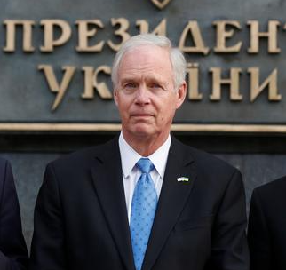

[24 Jan 2021: Senator Ron Johnson Tells Joe Biden To Choose Trump's Impeachment Trial or His Cabinet](https://www.newsweek.com/senator-ron-johnson-tells-joe-biden-choose-trump-impeachment-trial-cabinet-1563596)

[20 Jan 2021: Senator Ron Johnson calls editorial about him 'unhinged and uninformed.' The Editorial Board responds](https://www.jsonline.com/in-depth/news/solutions/2021/01/19/sen-ron-johnson-calls-editorial-unhinged-editorial-board-responds/4204754001/)

[17 Jan 2021: RoJo's terrible awful no-good week is coming: Targeted ads drawing attention to his role in initiating and promoting lies about the election](https://www.dailykos.com/stories/2021/1/14/2009239/-The-first-political-ads-of-the-next-cycle-are-already-here-and-Republicans-aren-t-happy)

[17 Jan 2021: Thomas Nelson to Ron Johnson; “Someone needs to go to Washington to do the work you’re supposed to do”. That “someone” will be Thomas Nelson @NelsonforWI](https://twitter.com/eileenvan55/status/1350060755463368706)

[12 Jan 2021: More evidence in support of RonJo's resignation or expulsion](https://crooksandliars.com/2021/01/ron-johnson-unfit-office?utm_source=social&utm_medium=facebook&utm_content=40795)

[12 Jan 2021: Cori Bush's Bill would investigate and expel "Senator" RonJo](https://www.facebook.com/socialsecurityworks/photos/a.155910007766200/4035823449774817/)

[11 Jan 2021: RoJo: Me & tRump bear no responsibility for the violence during the January 6 Insurrection](https://www.facebook.com/photo?fbid=10217288866966489&set=a.2233424647913)

[11 Jan 2021: Opportunities for WI to ditch RoJo](https://twitter.com/theProgEqualist/status/1348767650328031236)

[11 Jan 2021: RonJo must resign](https://www.facebook.com/socialsecurityworks/photos/a.155910007766200/4035823449774817/)

[11 Jan 2021: All RoJo's Russian/Ukranian communicants, including Derkach, Telizhenko, and Onyshchenko hit with US Treasury Department sanctions](https://twitter.com/OlgaNYC1211/status/1348664740436795393) See ["Ron J's Connection Network"](socnet.md)

[7 Jan 2021: Milwaukee Journal Sentinel Editorial: "Ron Johnson, Scott Fitzgerald and Tom Tiffany should resign or be expelled for siding with Trump against our republic"](https://www.jsonline.com/story/news/solutions/2021/01/07/ron-johnson-scott-fitzgerald-tom-tiffany-must-resign-expelled/6585447002/)

[7 Jan 2021: It’s clear: Ron Johnson aided and abetted yesterday’s insurrection. He must resign immediately](https://twitter.com/NelsonforWI/status/1347228398469476353)

[6 Jan 2021: 'senator' Ron Johnson insists neither he nor tRump have any responsibility for the Jan. 6 insurrection](https://www.facebook.com/sam.wunderle/posts/10217288871806610)

[6 Jan 2021: Final Reckoning: The 50 Most Disgraceful People of the Trump Administration by David Halperin: RonJon is declared a runner-up for 6th place, nudged out by Lindsey Graham](https://www.republicreport.org/2020/final-reckoning-the-50-most-disgraceful-people-of-the-trump-administration/)

[5 Jan 2021: Thomas Friedman calls out the Coup Plotters: "People who are, in effect, attempting the first legislative coup d’état in American history"](https://www.nytimes.com/2021/01/05/opinion/trump-republicans-election.html?action=click&module=Opinion&pgtype=Homepage)

[3 Jan 2021: @RonJohnsonWI from @SteveSchmidtSES Twitter thread: "I wanted to let you know what we are talking about at @ProjectLincoln tonight. The campaign against you will be the one you earned with your betrayal and sedition.  When we are done you will be an American villain who exceeds even the wretched McCarthy in ignominy"](https://twitter.com/SteveSchmidtSES/status/1345906690902908931)

[30 Dec 2020: WI newspaper hands RoJo his walking papers: "Plain Talk: If anything, 2020 showed we need to get Ron Johnson out of the Senate"](https://madison.com/ct/news/opinion/column/dave_zweifel/plain-talk-if-anything-2020-showed-we-need-to-get-ron-johnson-out-of-the/article_2bea2f6c-449a-11eb-80fd-2f8602d43083.html)

[28 Dec 2020: RoJo grateful for WashTimes coverage of Hunter Biden as the exception to general 'media suppression'](https://twitter.com/SenRonJohnson/status/1343645142650126336)

[19 Dec 2020: Sen. Josh Hawley (R-Mo.) on Friday went on the Senate floor to push legislation that would provide for $1,200 checks — double what is currently under consideration. Yet, Sen. Ron Johnson (R-Wis.), argued that sending more direct aid to Americans would be a fiscally irresponsible “shotgun approach.”](https://www.washingtonpost.com/us-policy/2020/12/18/government-funding-likely-expire-friday-night-congress-tries-complete-stimulus-deal/)

[18 Dec 2020: (Video) Senator Bernie Sanders rips into RoJoh for saying $1200 is too much economic relief](https://youtu.be/1z_Zc5TueYU)

[18 Dec 2020: Millionaire Republican Cites Deficit To Block Aid — After Enriching Himself With Special Tax Cuts](https://www.dailyposter.com/p/millionaire-republican-cites-deficit)

[18 Dec 2020: While opposing $1200 direct payment relief, RoJo is “concerned” about people's suffering and claims that COVID is an act of God. ](https://twitter.com/RexChapman/status/1340023426921148416)

[18 Dec 2020: GOP senator Ron Johnson blocks bill to provide $1,200 stimulus checks http://hill.cm/av54QaR](https://twitter.com/thehill/status/1339985803850764288)

[15 Dec 2020: Two weeks before the election, Johnson told business leaders in his state that Joe Biden’s election represented “the greatest threat to our freedom in my lifetime” and described himself as “panicked” about the possibility of a Trump loss](https://www.washingtonpost.com/politics/ron-johnson-trump-election-senate/2020/12/15/8e34c190-3e60-11eb-a402-fba110db3b42_story.html)

[15 Dec 2020: He must be so proud: "Ron Johnson could take his last stand Wednesday as Trump’s most stalwart Senate defender"](https://www.washingtonpost.com/politics/ron-johnson-trump-election-senate/2020/12/15/8e34c190-3e60-11eb-a402-fba110db3b42_story.html)

[14 Dec 2020: Thread: Links tie new post-Barr Deputy Attorney General Richard Donoghue with same Russian disinfo feeders, Derkach and Telizhenko, that fed Sen. RonJohn's Hunter Biden fishing expedition](https://twitter.com/OlgaNYC1211/status/1338621481123770369)

[14 Dec 2020: "Ron Johnson is chairman of the Senate Homeland Security Committee. He visited Russia and later helped them smear Americans. Today we learned that Russia hacked DHS. Good job, Russian Ron", @adamparkhomenko on Twitter](https://twitter.com/AdamParkhomenko/status/1338580218982838273)

[10 Dec 2020: Mark Pocan: "@SenRonJohnson's desperate need for Donald Trump's approval is beyond being a sycophant and bordering on being a cult follower or stalker"](https://madison.com/wsj/news/local/govt-and-politics/ron-johnson-called-scum-for-considering-challenge-to-election/article_4868c0db-cff3-51b2-a2fe-4371d77ed79f.html)

[4 Dec 2020: "Ron Johnson 'knows that Joe Biden won a free and fair election. He is refusing to admit it publicly'"](https://www.dailykos.com/stories/2020/12/2/1999512/-Ron-Johnson-knows-that-Joe-Biden-won-a-free-and-fair-election-He-is-refusing-to-admit-it-publicly)

[11 Nov 2020: tRump Barnacle RJohnson Tweet: "My committee has jurisdiction over USPS and the federal workforce. I’m asking anyone who knows of irregularities related to mail-in or absentee ballots to contact our confidential whistleblower hotline: whistleblower@ronjohnson.senate.gov"](https://twitter.com/SenRonJohnson/status/1326712457881153536)

[7 Nov 2020: Ron Johnson the day Biden is declared President Elect: "President Trump has tenaciously fought to make America better"](https://www.nbc15.com/2020/11/07/sen-johnson-president-trump-will-always-be-a-winner/) 

[6 Nov 2020: Sen. Ron Johnson says half of country won't accept a Biden win](https://madison.com/news/state_and_regional/govt-and-politics/sen-ron-johnson-says-half-of-country-wont-accept-a-biden-win/article_edf6fcee-206d-11eb-a922-672cc19ced3a.html)

[18 Oct 2020: tRump lackey RonJ goes Q Anon: Claims child porn found on Hunter Biden computer](https://twitter.com/i/status/1317849887438966784)

[03 Oct 2020: Sen RoJo attended GOP fundraiser after testing positive for COVID](https://www.dailykos.com/stories/2020/10/3/1983269/-Sen-Ron-Johnson-attended-GOP-fundraiser-after-testing-positive-for-COVID?utm_campaign=trending)

[03 Oct 2020: After testing positive for COVID-19, Ron Johnson says he's still against mask mandates](https://madison.com/ct/news/local/govt-and-politics/after-testing-positive-for-covid-19-ron-johnson-says-hes-still-against-mask-mandates/article_779c1b9f-e725-55cf-944c-03122be174e7.html#tracking-source=home-top-story)

[23 Sep 2020: The GOP’s own star witness just blew up Trump [and Johnson’s] ‘Hunterghazi’ smear](https://www.washingtonpost.com/opinions/2020/09/23/gops-own-star-witness-just-blew-up-trumps-huntergazi-smear/)

[23 Sep 2020: Johnson-Grassley Biden Report "little more than a rehashing of unproven allegations that echoed a Russian disinformation campaign"](https://www.nytimes.com/2020/09/23/us/politics/biden-inquiry-republicans-johnson.html)

[22 Sep 2020: Putin and senior Kremlin leaders involved in "and probably directing" interference in US 2020 presidential election with anti-Biden messaging. Sen. Johnson is fully on board](https://www.washingtonpost.com/opinions/2020/09/22/secret-cia-assessment-putin-probably-directing-influence-operation-denigrate-biden/)

[22 Sep 2020: Sen. Ron on the loss of RGB: "Let's let voters have a voice in this through their vote for president and for the control of the Senate," Oh, wait, that was 2016](https://www.jsonline.com/story/news/politics/elections/2020/09/19/sen-johnson-argued-2016-high-court-vacancies-should-not-filled-election-year/5838244002/) 

[17 Sep 2020: Digging into the origin story of Sen. RoJo's anti-Biden investigations](https://www.dailykos.com/stories/2020/9/17/1978164/-If-GOP-Sen-Ron-Johnson-isn-t-a-Russian-asset-he-s-certainly-behaving-like-one)

[16 Sep 2020: Johnson kills Schumer/Widen resolution calling for "the cessation of any Senate investigation or activity that allows Congress to act as a conduit for Russian disinformation.”](https://www.marketwatch.com/story/mitt-romney-says-fellow-senate-republican-ron-johnsons-probe-into-biden-son-is-not-a-legitimate-function-of-government-2020-09-16)

[15 Sep 2020: Ronjo will be voted authorization to issue subpoenas in Biden investigation to former FBI Director McCabe and scores of others](https://thehill.com/homenews/senate/515693-senate-panel-to-vote-next-week-on-authorizing-subpoenas-for-biden-obama-era)

[14 Sep 2020: RonJo claims "Trump should win 'at least one' Nobel Peace Prize"](https://www.jsonline.com/story/news/politics/elections/2020/09/14/wisconsin-ron-johnson-says-donald-trump-should-win-nobel-peace-prize/5791780002/)

[12 Sep 2020: Johnson's anti-Biden report "underwritten with taxpayer dollars...based on a long-debunked, hardcore right-wing conspiracy theory"](https://www.washingtonpost.com/national-security/biden-ukraine-senate-investigation/2020/09/11/e969d848-f379-11ea-999c-67ff7bf6a9d2_story.html?hpid=hp_hp-banner-main_bidenprobe-925am%3Ahomepage%2Fstory-ans)

[11 Sep 2020: Oleksandr Onyshchenko joins Alexii Derkach on the list of Ukranians claiming to have sent anti-Biden info to Sen. Johnson and Rudy Giuliani](https://www.dailykos.com/stories/2020/9/11/1976719/-Looky-here-Trump-allies-Biden-smears-informed-by-active-Russian-agent-for-over-a-decade)

[4 Sept 2020: Ron Johnson got $12.6 million, or 70% of his 2015-2020 total campaign funds, from large individual contributors](https://www.opensecrets.org/members-of-congress/summary?cid=N00032546)

[31 Aug 2020: "Republican Ron Johnson refuses to condemn alleged Kenosha shooter"](https://www.salon.com/2020/08/31/republican-ron-johnson-refuses-to-condemn-alleged-kenosha-shooter-when-pressed-by-cnn-host_partner/)

[26 Aug 2020: "Performing his usual role as the president’s political valet, Johnson greeted DeJoy at a hearing on August 21 with lavish praise and a nutty conspiracy theory."--Milwaukee Independent](http://www.milwaukeeindependent.com/syndicated/senator-ron-johnson-is-playing-the-fool-on-trumps-behalf-in-order-to-wreck-the-postal-service/)

[24 Aug 2020: Ronjo and Manafort: Scratch my back, I'll scratch yours: Ukrainegate 2.0](https://www.justsecurity.org/72148/manaforts-reward-sen-ron-johnson-and-the-ukraine-conspiracy-investigation-part-ii/)

[22 Aug 2020: Per Ronjo, the idea that PM DeJoy is trashing the postal service six ways from Sunday is a "false political narrative" and a "conspiracy theory"](https://www.jsonline.com/story/news/politics/2020/08/21/ron-johnson-false-political-narrative-postmaster-general/3406946001/)

[19 Aug 2020: Johnson hopes to end-run House investigation of postal service](https://www.dailykos.com/stories/2020/8/18/1970295/-Johnson-hopes-to-pre-empt-House-efforts-on-Postal-Service-he-might-not-have-thought-that-through?utm_campaign=trending)

[15 Aug 2020: Sen. Johnson promotes Russian misinformation as Chair of the Homeland Security and Governmental Affairs Comm.](https://twitter.com/SteveSchmidtSES/status/1294786356267417601?cxt=HHwWgoC8lZfVgPgjAAAA)

_UPDATED_: [14 Aug 2020: On a video interview with OAN, Sen. Johnson claims "incredibly incriminating evidence" about Bidens](https://youtu.be/vzjyF8_KqUM)

>Mediabiasfactcheck.com on One American News Network (OAN): "Overall, we rate One America News Questionable based on far-right bias, lack of sourcing, promotion of conspiracy theories, and propaganda as well as numerous failed fact checks. OAN is not a credible news source."

[14 Aug 2020: Senator RonJo's Committee parroting Russian Misinformation?](https://www.marketwatch.com/story/wisconsin-republican-ron-johnson-on-defensive-over-probe-of-biden-and-ukraine-in-wake-of-intelligence-assessment-on-ongoing-russian-election-interference-2020-08-13)

[14 Aug 2020: Sen. Johnson's bogus probe aims to help Trump. He told us so himself](https://www.dailykos.com/stories/2020/8/14/1969289/-GOP-Sen-Ron-Johnson-gets-caught-admitting-his-bogus-investigation-will-boost-Trump-s-reelection)

[11 Aug 2020: Ron Johnson's investigations of the Bidens has become a conduit of Russian misinformation](https://www.justsecurity.org/71947/how-sen-ron-johnsons-investigation-became-an-enabler-of-russian-disinformation-part-i/)

[9 Aug 2020: New Congressional Integrity Report on Ron Johnson's Personal Corruption](http://www.milwaukeeindependent.com/syndicated/new-report-details-how-senator-ron-johnson-betrayed-wisconsin-to-make-millions-in-personal-profit/)

[20 July 2020: RJ give his Senate Homeland Security Committee info from former Ukrainian official, Andrii Telizhenko, a known conduit for russian disinformation](https://www.nytimes.com/2020/07/20/us/politics/congress-disinformation-biden-russia-ukraine.html)

[3 Jun 2020: RJ and Authoritarianism](https://www.facebook.com/thomaskeen.nvcd/posts/568788330703623)

[11 Mar 2020: "Staff members for [Sen. Johnson's] committee have been working with Mr. Telizhenko for months, interviewing him and collecting documents to bolster two separate investigations into subjects that could help President Trump as he heads into a re-election campaign"](https://www.nytimes.com/2020/03/11/us/politics/senate-subpoena-ron-johnson-ukraine.html)

[20 Jan 2019: Ron Johnson vote clears way to lift sanctions on Russian oligarch Oleg Deripaska](https://madison.com/wsj/news/local/govt-and-politics/roll-call-key-votes-from-the-wisconsin-congressional-delegation-this-week/article_0dedee09-59a1-59ce-9710-bc99e39594e3.html)

[16 Jan 2019: Moscow Mitch lobbies hard to lift sanctions on one of Putin's favorite oligarchs, Oleg Deripaska. RonJo salutes and votes. Schumer's comment: "Gives Vladimir Putin exactly what he wants"](https://www.dailykos.com/stories/2020/12/30/2004140/-Why-is-McConnell-Getting-Away-with-the-Deripaska-Scandal?pm_source=story_sidebar&pm_medium=web&pm_campaign=recommended)

[4 July 2018: Johnson one of eight Republican legislators spending the 4th of July in Moscow](https://www.washingtonpost.com/opinions/eight-republicans-spent-july-4-in-russia-where-are-the-fireworks/2018/07/06/beae30be-812e-11e8-b658-4f4d2a1aeef1_story.html)
